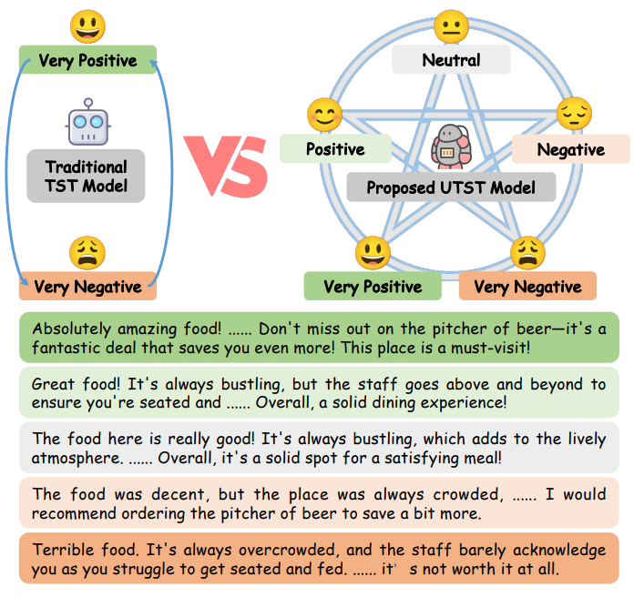
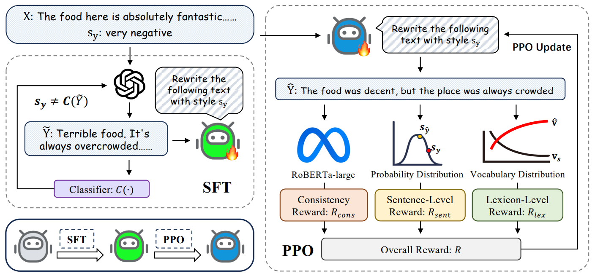
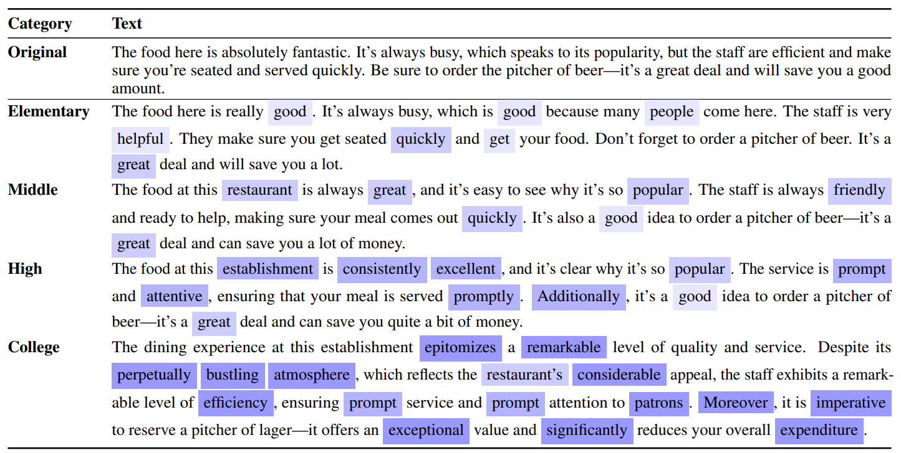
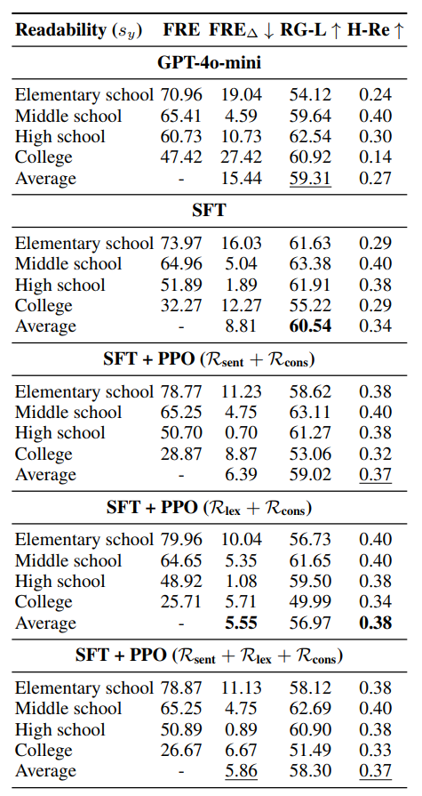
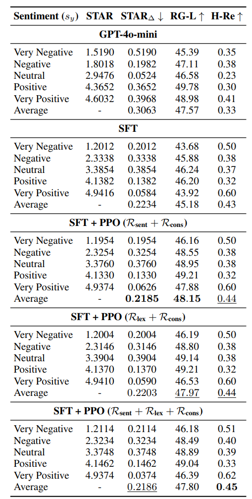

<h1 align="center">
  <strong>Unsupervised Text Style Transfer for Controllable Intensity</strong>
</h1>

<div align="center">

[](http://arxiv.org/abs/2601.01060)

</div>

# Quick Links
+ [Overview](#overview)

+ [Requirements](#requirements)

+ [Data Preparation](#data-preparation)

+ [Experiments](#experiments)

## Overview

This repository contains the implementation of **Unsupervised Text Style Transfer for Controllable Intensity**, a framework for controlling the intensity of style transfer in text generation tasks. The project focuses on two main style transfer tasks:

- **Readability Transfer**: Adjusting text complexity and readability levels
- **Sentiment Transfer**: Modifying sentiment polarity with controllable intensity

The framework supports both Supervised Fine-Tuning (SFT) and Reinforcement Learning (RL) approaches using the trlx library.

<div align="center">
  
  <p><em>Figure 1: Overview of the proposed method for controllable intensity text style transfer</em></p>
</div>

### Model Architecture

<div align="center">
  
  <p><em>Figure 2: Model architecture</em></p>
</div>

## Requirements

Install the required dependencies:

```bash
pip install -r requirements.txt
```

Main dependencies include:
- PyTorch 2.0.1
- Transformers 4.46.3
- trlx 0.7.0
- DeepSpeed (for distributed training)
- Various NLP evaluation libraries (bert_score, textstat, etc.)

**Note**: The requirements.txt contains some duplicate entries that should be cleaned up.

## Data Preparation

### Readability

The data should be prepared in JSON format with parallel text pairs. Expected format:

```json
{
  "input_text_prompt": "source text with prompt",
  "output_text": "target text with desired readability"
}
```

Place your data files in the `data/` directory:
- `train_summary_prompt_parallel.json` - Training data
- `val_summary_prompt_parallel.json` - Validation data

You can use the preprocessing script to generate readability-controlled data:

```bash
python src/preprocess/generate_readability_by_gpt.py
```

### Sentiment

Similar data preparation process for sentiment transfer tasks. Prepare parallel data with source and target sentiment levels.

## Experiments

### Training

#### Supervised Fine-Tuning (SFT)

Train the model using supervised fine-tuning:

```bash
bash scripts/train_sft_readability.sh
```

This script uses DeepSpeed for distributed training with the following key parameters:
- Learning rate: 1e-4
- Batch size: 8 per device
- Max source length: 1024
- Training epochs: 20

#### Reinforcement Learning (RL)

Train with reinforcement learning for better control:

```bash
bash scripts/train_rl_readability.sh
```

### Inference

Run inference on test data:

```bash
# SFT model inference
bash scripts/inference_sft_readability.sh

# RL model inference
bash scripts/inference_rl_readability.sh
```

### Evaluation

The project includes various evaluation metrics:
- ROUGE scores for text quality
- BERTScore for semantic similarity
- Readability metrics (Flesch-Kincaid, etc.)
- Feature extraction and cosine similarity analysis

### Example Outputs

<div align="center">
  
  <p><em>Figure 3: Examples of text style transfer with different intensity levels</em></p>
</div>

## Results

<div align="center">
  
  <p><em>Figure 4: Experimental results - Part 1</em></p>
</div>

<div align="center">
  
  <p><em>Figure 5: Experimental results - Part 2</em></p>
</div>

## Project Structure

```
UTST-CI/
├── data/              # Training and validation data
├── figs/              # Figures and visualizations
├── scripts/           # Training and inference scripts
│   ├── train_sft_readability.sh
│   ├── train_rl_readability.sh
│   ├── inference_sft_readability.sh
│   └── inference_rl_readability.sh
├── src/
│   ├── preprocess/    # Data preprocessing scripts
│   ├── train/         # Training scripts
│   └── inference/     # Inference scripts
├── requirements.txt
└── README.md
```

## Citation

If you use this code in your research, please cite:

```bibtex
@article{gu2026unsupervised,
  title={Unsupervised Text Style Transfer for Controllable Intensity},
  author={Gu, Shuhuan and Tao, Wenbiao and Ma, Xinchen and He, Kangkang and Guo, Ye and Li, Xiang and Lan, Yunshi},
  journal={arXiv preprint arXiv:2601.01060},
  year={2026},
  url={https://arxiv.org/abs/2601.01060}
}
```

## License

This project is licensed under the Apache License 2.0 - see the [LICENSE](LICENSE) file for details.

